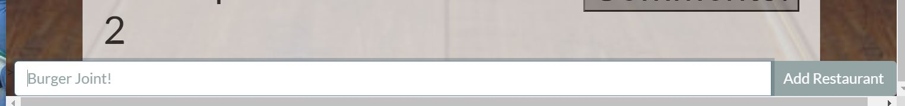
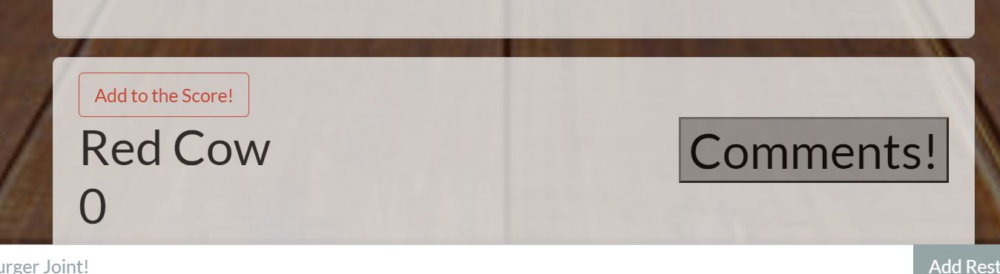
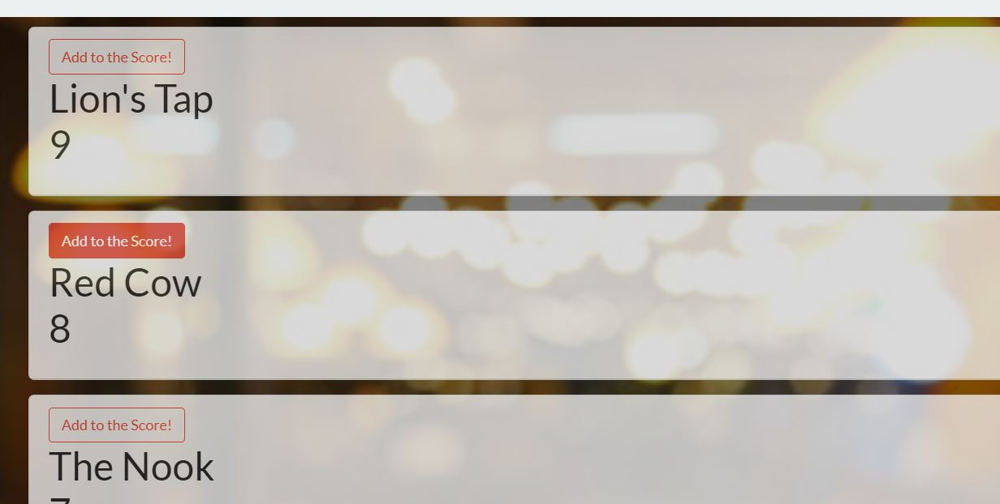

# Burger-Battle
The Burger Battle app let's you add your favorite burger place to the battle, and you can see how people think it ranks against the competition.


## Table of Contents
  * [Collaborators](#collaborators)
  
  * [Installation](#installation)

  * [Link](#link)

  * [Installation](#installation)

  * [Usage](#usage)
  
  * [License](#license)
  
  * [Questions](#questions)

   ## Collaborators
   Dylan Lucarelli https://github.com/dlucarelli

   Tim Bluhm https://github.com/TJblue94
   
   Carl Koepke https://github.com/Carl-33


   ## Installation 
   Download the application files, make sure you run 
   ```
   npm i sequelize mysql express
   ```
   prior to launch.  You can then run the application on your localhost, and the schema.sql will create your database for you.

   ## Link
   Click here to join the battle: https://combusken-crew.herokuapp.com/

   ## Usage 
   Start by adding your favorite burger joint in the input field at the bottom of the page. 
   
   


   Your favorite buger joint will show up at the bottom of the page with 0 points to start. 
   
   

   Simply click the 'Add to Score!' button to increase your favorite spots score.  The page will automatically update to show the new rannkings.

  

  ## License 
  <https://unlicense.org>

  ## Contributions
  Huge thank you to Gage, Matt, and Kieren (last names unknown) for helping us troubleshoot.

  ## Questions 
  Feel free to reach out with any questions.

   
  
